Micro Maya Mesh Editor
==================================

**University of Pennsylvania, CIS 560: Introduction to Computer Graphics**

* Bowen Deng
  * [LinkedIn](www.linkedin.com/in/bowen-deng-7dbw13)

## Abstract

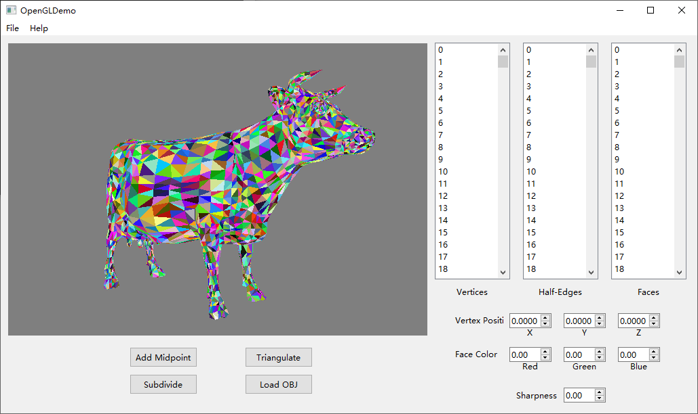

A mesh editor based on half-edge structure, assembled with Maya-like features like triangulation, edge splitting, Catmull-Clark subdivision with sharp edges/vertices, and skeleton control with skin deformation.

## Half-Edge Data Structure

Half-edges are directed edges that form a ring around a particular face. Each traditional edge is composed of two symmetric half-edges. A mesh based on half-edge structure includes vertices, faces, and half-edges.

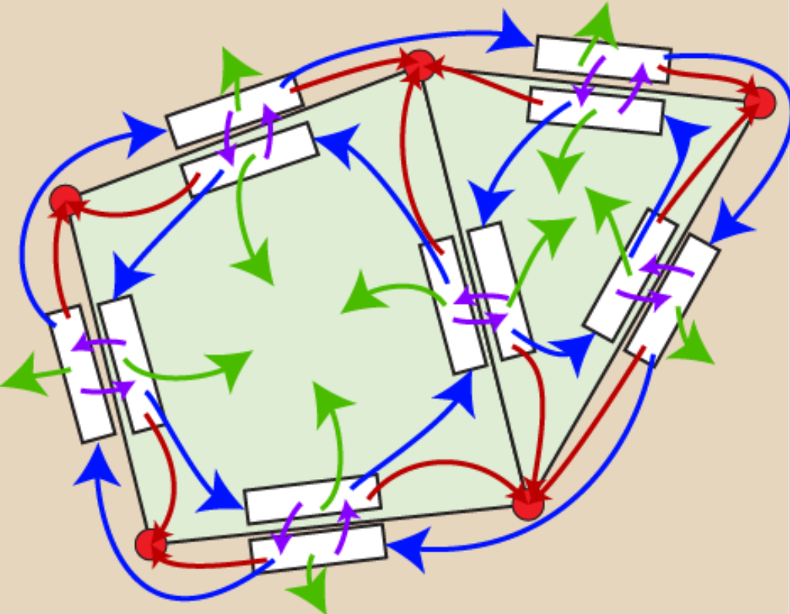

In this way, adjacent information (i.e. spacial adjacent faces) is stored. Besides, each component in the structure has a fixed size.

## Mesh Editing

### Basic Functionality

An arbitrary 3D object can be loaded from OBJ files, and constructed as a half-edge based mesh. Once loaded, each component of it can be viewed and selected for highlight displaying.

| vertex | half-edge | face |
| ------------------------ | ------------------------ | ----------------------- |
| 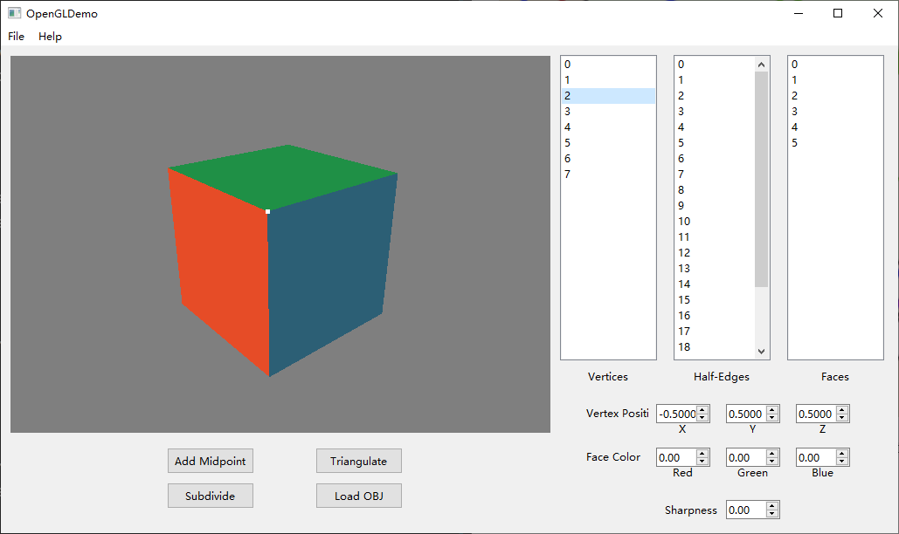 | 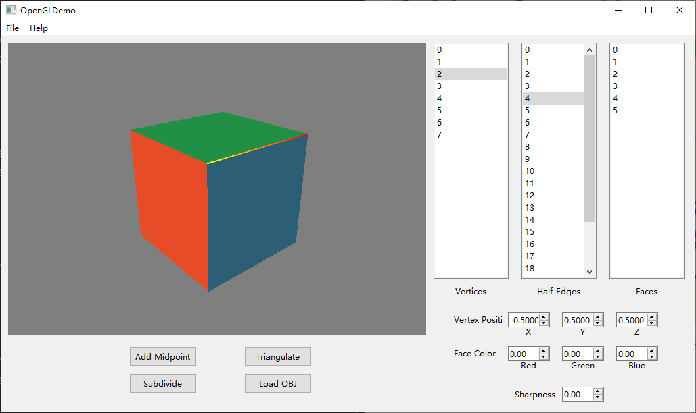 |  |

The position of a selected vertex and the color of a selected face can be modified through the spin boxes.

### Topology Editing Functions

- **Edge Splitting**

Split an edge by adding a midpoint onto it.

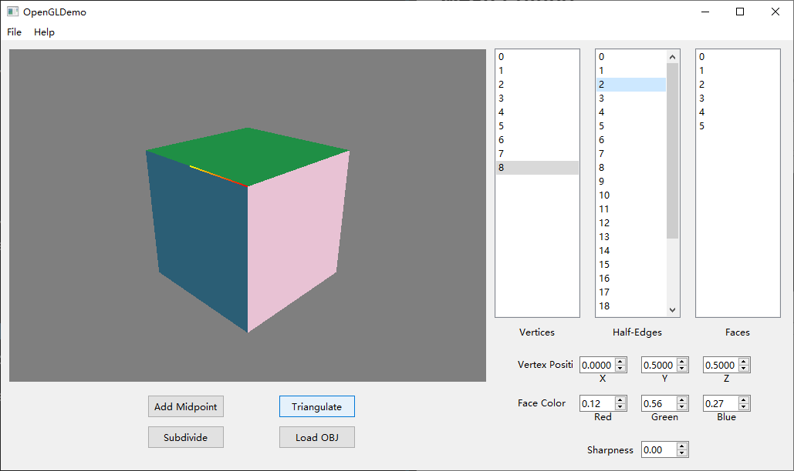

- **Triangulation**

Triangulate a face.

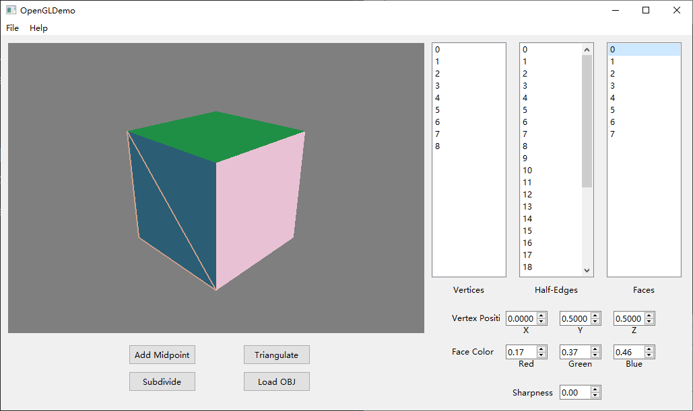

## Catmull-Clark Subdivision

### Subdivision

Subdivision recursively adds vertices to a mesh to smooth it. The result of subdivision converges to the form of B-spline surface with original vertices as control points. For example, a cube will become a sphere after several iterations.

| origin | after subdivision |
| ------------------------ | ------------------------ |
| 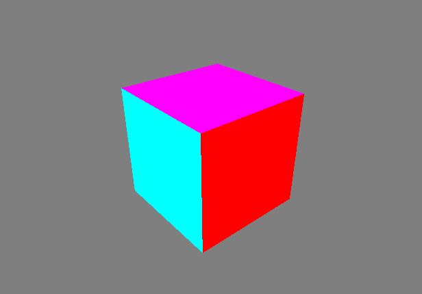 | 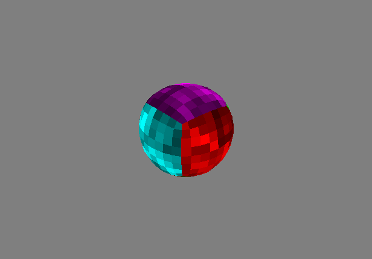 |

### Sharp Vertices and Edges

An edge or a vertex can be marked as sharp to keep it "sharp" during the process of subdivision. For example, if we set one vertex of the cube as sharp, we will get a drop-like shape after subdivision.

Another example shows a cylinder shape by setting all edges on top and bottom faces as sharp.

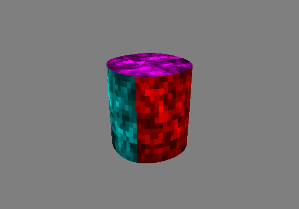

Further more, semi-sharpness is allowed when the value typed into `sharpness` is between 0 and 1. See how the examples above changes with different sharpness configuration.

| Semi-Sharp | Sharper | Fully Sharp |
| ------------------------ | ------------------------ | ----------------------- |
| 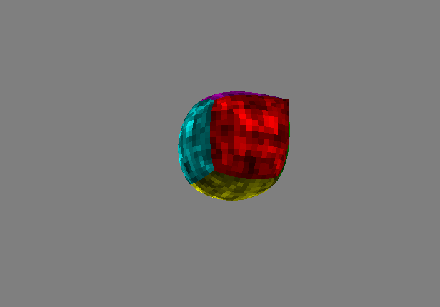 | 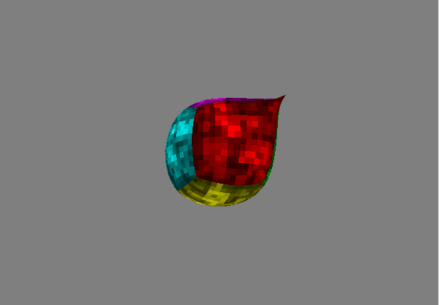 |  |
| sharpness = 0.5 | sharpness = 0.75 | sharpness = 1 |

| Semi-Sharp | Sharper | Fully Sharp |
| ------------------------ | ------------------------ | ----------------------- |
| 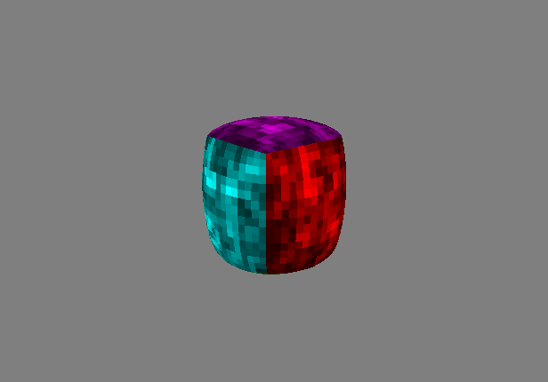 | 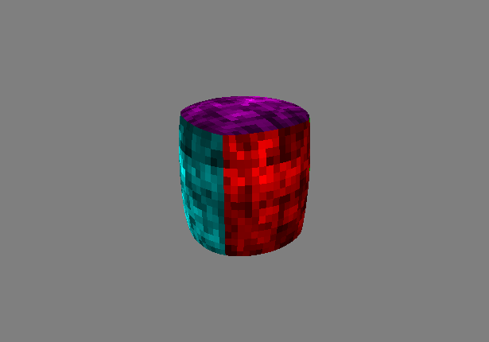 |  |
| sharpness = 0.5 | sharpness = 0.75 | sharpness = 1 |

## Skeletons and Skinning

(Preview of this part is on building... Available before Nov 3)
